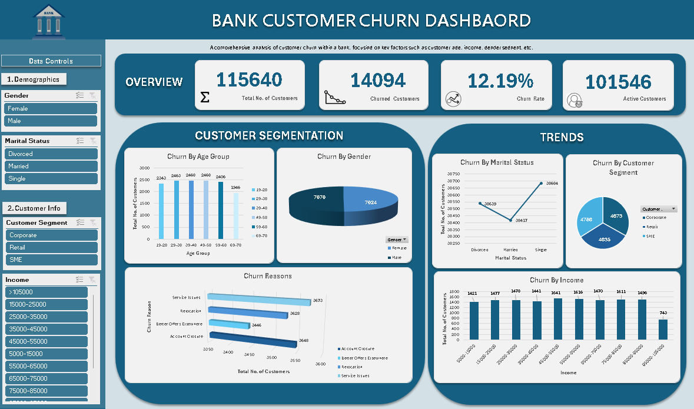

# Bank-Customer-Churn-Dashboard
Excel dashboard analyzing customer churn patterns based on demographics, income, and customer segment.

This Excel dashboard analyzes customer churn patterns for a retail bank.  
It visualizes key metrics like churn rate, active customers, income segments, and churn reasons.

## Features
- Gender, Marital Status, Segment, and Income filters (interactive slicers)
- KPI cards for total customers, churned customers, and churn rate
- Visual breakdowns of churn by age, gender, income, and segment

## Tools Used
- Microsoft Excel
- PivotTables and Slicers
- Data Visualization & Formatting

## Data Used
- Synthetic dataset from Kaggle - bank-churn-data

## Dashboard Preview

